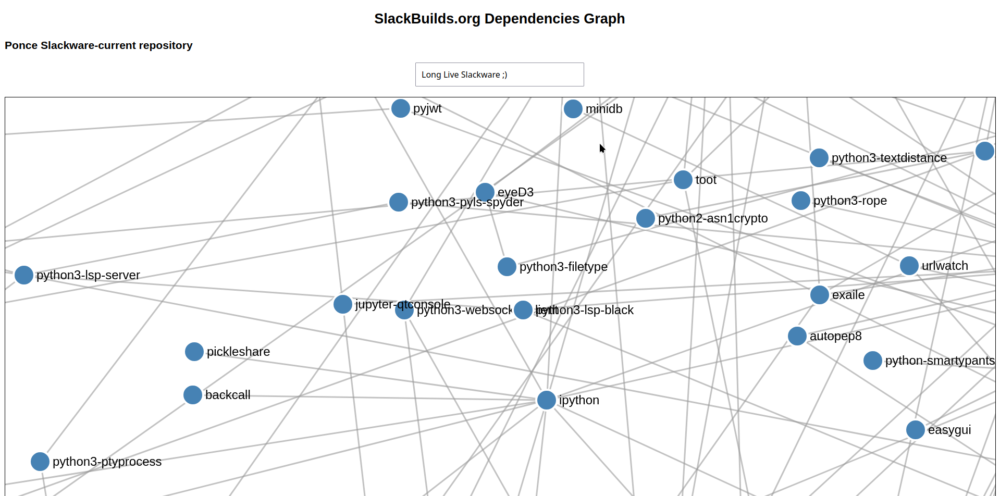

# SlackBuilds.org_Dependencies_Graph
visualizes the dependencies between all SlackBuilds scripts using a D3.js force-directed graph. You can explore nodes and their connections, search for specific packages, and interact with the graph to explore dependencies.
---

--- 

[video](https://www.youtube.com/watch?v=Qvsoa1hI_Z8)

---

## BUILD 

`git clone https://github.com/rizitis/SlackBuilds.org_Dependencies_Graph.git`  
`cd SlackBuilds.org_Dependencies_Graph`  
`npm init -y`  
`npm install express axios`  

#### Run server
`node server.js` 

Open your browser `http://localhost:3000`  

To kill server Ctrl+C 

#### Required
`slpkg to be installed, focus to ponce repo and updated`

